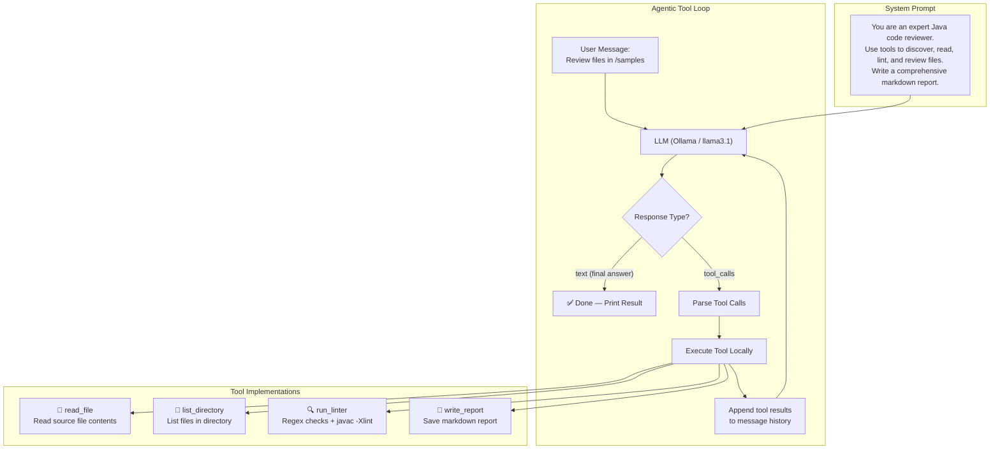

# AI Code Reviewer Agent

An autonomous AI Code Reviewer agent implemented in Java 25 with Ollama as the LLM backend.  
Built **twice** to demonstrate the difference between manual tool orchestration and framework-based automation.

| Phase | Approach | Key Classes |
|-------|----------|-------------|
| **Phase 1** | Manual agentic loop with `java.net.http.HttpClient` | `ManualAgentLoop`, `OllamaClient`, `ToolRegistry` |
| **Phase 2** | LangChain4j `AiServices` with `@Tool` annotations | `CodeReviewAssistant`, `CodeReviewTools`, `OllamaChatModel` |

---

## Architecture



### Loop Control

| Parameter | Value | Purpose |
|-----------|-------|---------|
| Max iterations | 20 | Prevents infinite loops |
| Termination | No `tool_calls` in response | Model returns final text answer |
| Error handling | Errors returned as tool results | LLM can recover gracefully |
| History | Full `messages[]` array | Maintained across all iterations |

---

## Tool Schemas

### `read_file`
```json
{
  "name": "read_file",
  "description": "Read the contents of a source file at the given path",
  "parameters": {
    "type": "object",
    "properties": {
      "path": { "type": "string", "description": "Absolute or relative path to the file" }
    },
    "required": ["path"]
  }
}
```

### `list_directory`
```json
{
  "name": "list_directory",
  "description": "List all files in a directory, optionally recursive",
  "parameters": {
    "type": "object",
    "properties": {
      "path": { "type": "string", "description": "Path to the directory" },
      "recursive": { "type": "boolean", "description": "Whether to list recursively (default: false)" }
    },
    "required": ["path"]
  }
}
```

### `run_linter`
```json
{
  "name": "run_linter",
  "description": "Run style checks and basic static analysis on a Java file. Includes regex-based pattern checks and optional javac -Xlint compiler warnings.",
  "parameters": {
    "type": "object",
    "properties": {
      "path": { "type": "string", "description": "Path to the Java source file" }
    },
    "required": ["path"]
  }
}
```

### `write_report`
```json
{
  "name": "write_report",
  "description": "Save the final code review report as a markdown file",
  "parameters": {
    "type": "object",
    "properties": {
      "path": { "type": "string", "description": "Output file path for the report" },
      "content": { "type": "string", "description": "Markdown content of the review report" }
    },
    "required": ["path", "content"]
  }
}
```

---

## System Prompt

```
You are an expert Java code reviewer with deep knowledge of clean code principles,
SOLID design patterns, and Java best practices.

Your task: Review the Java source files in the provided project directory.

Workflow:
1. Use list_directory to discover all .java files in the project.
2. Use read_file to read each source file.
3. Use run_linter to get automated style/issue feedback on each file.
4. Analyze the code for: naming conventions, error handling, complexity,
   code smells, potential bugs, and design improvements.
5. Use write_report to save a comprehensive markdown review report.

Report structure:
- Executive summary
- Per-file findings (with line numbers and code quotes)
- Severity ratings (CRITICAL / WARNING / INFO)
- Concrete refactoring suggestions with code examples

Be specific: reference exact line numbers, quote problematic code,
and provide concrete improvement suggestions.
```

---

## Prerequisites

- **Java 25** (or 21+)
- **Maven 3.9+**
- **Ollama** running locally with `llama3.1` model:
  ```bash
  ollama pull llama3.1
  ollama serve   # if not already running
  ```

## Quick Start

```bash
# Build
mvn clean compile

# Run Phase 1 — Manual Loop
mvn exec:java -Dexec.mainClass="com.hrsinternational.manual.ManualAgentMain"

# Run Phase 2 — LangChain4j
mvn exec:java -Dexec.mainClass="com.hrsinternational.framework.FrameworkAgentMain"
```

Reports are saved to `output/reports/`.

---

## Project Structure

```
agent_app/
├── pom.xml
├── README.md
├── samples/                              # Intentionally flawed code for review
│   ├── BadCalculator.java
│   └── UserService.java
├── output/reports/                        # Generated review reports
├── src/main/java/com/hrsinternational/
│   ├── tools/                             # Shared tool implementations
│   │   ├── ReadFileTool.java
│   │   ├── ListDirectoryTool.java
│   │   ├── RunLinterTool.java
│   │   ├── WriteReportTool.java
│   │   └── ToolRegistry.java
│   ├── manual/                            # Phase 1: Raw HTTP agentic loop
│   │   ├── OllamaClient.java
│   │   ├── ManualAgentLoop.java
│   │   └── ManualAgentMain.java
│   └── framework/                         # Phase 2: LangChain4j migration
│       ├── CodeReviewTools.java
│       ├── CodeReviewAssistant.java
│       └── FrameworkAgentMain.java
├── src/main/resources/
│   └── config.properties
└── src/test/java/com/hrsinternational/
    └── tools/
        └── ToolRegistryTest.java
```
